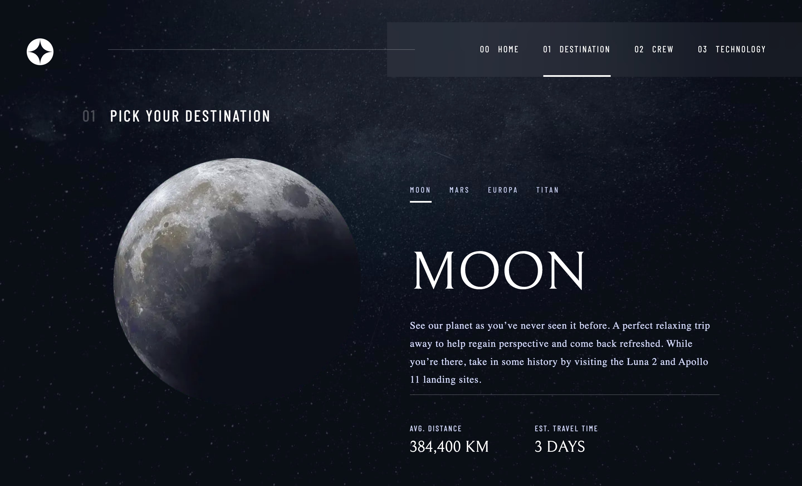

# Frontend Mentor - Space tourism website solution

This is a solution to the [Space tourism website challenge on Frontend Mentor](https://www.frontendmentor.io/challenges/space-tourism-multipage-website-gRWj1URZ3). Frontend Mentor challenges help you improve your coding skills by building realistic projects.

## Table of contents

- [Overview](#overview)
  - [The challenge](#the-challenge)
  - [Screenshot](#screenshot)
  - [Links](#links)
- [My process](#my-process)
  - [Built with](#built-with)
  - [What I learned](#what-i-learned)
  - [Continued development](#continued-development)
  - [Useful resources](#useful-resources)
- [Author](#author)
- [Acknowledgments](#acknowledgments)

## Overview

### The challenge

Users should be able to:

- View the optimal layout for each of the website's pages depending on their device's screen size
- See hover states for all interactive elements on the page
- View each page and be able to toggle between the tabs to see new information

### Screenshot

### Links

- Solution URL: [https://github.com/NikitaVologdin/Next-Space-Tourism](https://github.com/NikitaVologdin/Next-Space-Tourism)
- Live Site URL: [https://next-space-tourism.vercel.app/](https://next-space-tourism.vercel.app/)

## My process

### Built with

- Semantic HTML5 markup
- CSS custom properties
- Flexbox
- CSS Grid
- Mobile-first workflow
- Figma
- [React](https://reactjs.org/) - JS library
- [Next.js](https://nextjs.org/) - React Framework
- [Motion](https://motion.dev/) - Animation Library
- [Firestore](https://firebase.google.com/docs/firestore) - Cloud database

### Continued development

- Error handling
- Loading interface

### Useful resources

- [How to read files on vercel deployment](https://medium.com/@boris.poehland.business/next-js-api-routes-how-to-read-files-from-directory-compatible-with-vercel-5fb5837694b9) - This helped me to understand how to better construct path for the file on the vercel deployment.
- [The difference between path and join in node](https://stackoverflow.com/questions/35048686/whats-the-difference-between-path-resolve-and-path-join) - This thread helps to understand difference between path.join() and path.resolve() methods.
- [Page transition](https://blog.logrocket.com/advanced-page-transitions-next-js-framer-motion/#implementing-page-transitions-app-router) - Explains how to implement page transition for page and app routers in NextJS.

## Author

- Website - [Nikita Vologdin](https://vologdin.eu/portfolio)
- Frontend Mentor - [@NikitaVologdin](https://www.frontendmentor.io/profile/NikitaVologdin)
